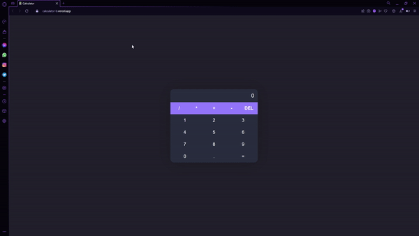

<h1 align="center">Welcome to calculator 👋</h1>
<p>
  
  <a href="https://twitter.com/r_macedo77" target="_blank">
    
  </a>
</p>

> Project developed for personal evolution

> Performs basic operations between numbers, addition, subtraction, division and multiplication.

<p align="center">
  
</p>

## Install

```sh
npm install
```

```sh
npm start
```

## Author

👤 **Renata Macedo**

- Twitter: [@r_macedo77](https://twitter.com/r_macedo77)
- Github: [@macedo-developer](https://github.com/macedo-developer)
- LinkedIn: [@macedorenata](https://linkedin.com/in/macedorenata)

## Show your support

Give a ⭐️ if this project helped you!
